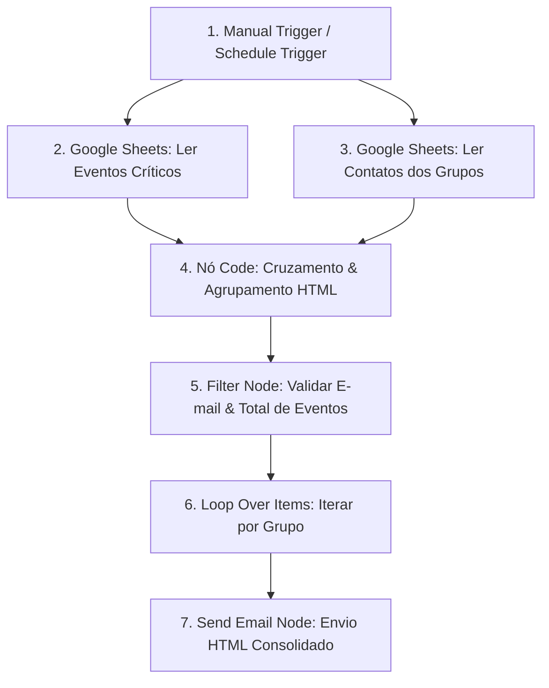

# 🚀 Automação N8N: Cobrança Diária de Eventos Críticos por Grupo de Atribuição

Este projeto consiste em uma automação desenvolvida no **N8N** para extração, consolidação, validação e notificação por e-mail de eventos/chamados críticos pendentes, agrupados por seus respectivos grupos de atribuição.

O objetivo principal é otimizar o tempo de resposta operacional e garantir que cada equipe receba uma notificação única e consolidada contendo todos os incidentes sob sua responsabilidade.

---

## 📌 1. Visão Geral da Solução

A automação conecta duas bases de dados mantidas no **Google Sheets**:
1. **Base de Eventos Críticos:** Contém a lista de chamados/incidentes, status e o grupo responsável.
2. **Base de Grupos e Contatos:** Mapeia cada grupo de atribuição ao seu e-mail de contato corporativo.

A automação cruza os dados, filtra apenas os eventos pendentes, agrupa os incidentes por equipe, gera uma tabela formatada em HTML e envia um e-mail de cobrança para cada responsável.

---

## 🏗️ 2. Arquitetura da Automação (Workflow)



---

## 📊 3. Estrutura das Planilhas (Google Sheets)

Para o correto funcionamento do fluxo, a planilha no Google Sheets deve conter as seguintes abas e colunas:

### Aba 1: `Eventos_Criticos`
| Coluna | Descrição | Exemplo |
| :--- | :--- | :--- |
| `ID_Evento` | Código identificador do evento/chamado | `INC-1024` |
| `Titulo_Evento` | Descrição sucinta do evento | `Queda no Servidor DB2` |
| `Grupo_Atribuicao` | Grupo responsável pela atuação | `IOB - EUC` |
| `Status` | Status atual do chamado | `Aberto` / `Em Andamento` |
| `Criticidade` | Nível de severidade | `Crítica` / `Alta` |

### Aba 2: `Grupos_Contatos`
| Coluna | Descrição | Exemplo |
| :--- | :--- | :--- |
| `Grupo_Atribuicao` | Nome exato do grupo de atribuição | `IOB - EUC` |
| `Email_Contato` | E-mail corporativo ou lista do grupo | `euc@dominio.com` |
| `Responsavel` | Nome do responsável ou equipe | `Equipe End User` |

---

## ⚙️ 4. Regras de Negócio e Validações

1. **Filtro de Incidentes Ativos:** Apenas eventos com status diferente de `Fechado` ou `Resolvido` são processados.
2. **Agrupamento Único (Anti-Spam):** Se o grupo `IOB - EUC` tiver 10 chamados abertos, ele receberá **apenas 1 e-mail** contendo uma tabela com os 10 chamados.
3. **Validação de E-mail:** Caso um grupo de atribuição não possua e-mail cadastrado na planilha de contatos, o fluxo interrompe o envio para aquele grupo sem quebrar o processamento dos demais.
4. **Validação de Conteúdo:** E-mails só são disparados se houver pelo menos 1 evento crítico associado ao grupo (`totalEventos > 0`).

---

## 💻 5. Lógica de Processamento (Nó Code JS)

O nó de processamento unifica os dados das duas planilhas e constrói o modelo HTML:

```javascript
// Captura os dados dos nós do Google Sheets
const eventos = $('Google Sheets - Eventos').all().map(item => item.json);
const contatos = $('Google Sheets - Contatos').all().map(item => item.json);

// Mapeia os e-mails por Grupo de Atribuição
const emailMap = {};
contatos.forEach(c => {
  if (c.Grupo_Atribuicao && c.Email_Contato) {
    emailMap[c.Grupo_Atribuicao.trim()] = c.Email_Contato.trim();
  }
});

// Agrupa eventos pendentes por Grupo
const gruposAgrupados = {};

eventos.forEach(ev => {
  if (ev.Status !== 'Fechado' && ev.Status !== 'Resolvido' && ev.Grupo_Atribuicao) {
    const grupo = ev.Grupo_Atribuicao.trim();
    if (!gruposAgrupados[grupo]) {
      gruposAgrupados[grupo] = [];
    }
    gruposAgrupados[grupo].push(ev);
  }
});

// Monta o objeto de saída com a tabela HTML formatada
const resultado = [];

for (const grupo in gruposAgrupados) {
  const listaEventos = gruposAgrupados[grupo];
  const emailDestino = emailMap[grupo];

  let tabelaHtml = `
  <table border="1" cellpadding="8" cellspacing="0" style="border-collapse: collapse; width: 100%; font-family: Arial, sans-serif;">
    <thead>
      <tr style="background-color: #202938; color: #ffffff;">
        <th>ID Evento</th>
        <th>Título / Descrição</th>
        <th>Criticidade</th>
        <th>Status</th>
      </tr>
    </thead>
    <tbody>`;

  listaEventos.forEach(ev => {
    tabelaHtml += `
      <tr>
        <td><b>${ev.ID_Evento || '-'}</b></td>
        <td>${ev.Titulo_Evento || '-'}</td>
        <td style="color: #dc2626; font-weight: bold;">${ev.Criticidade || '-'}</td>
        <td>${ev.Status || '-'}</td>
      </tr>`;
  });

  tabelaHtml += `</tbody></table>`;

  resultado.push({
    json: {
      grupoAtribuicao: grupo,
      emailDestino: emailDestino || null,
      totalEventos: listaEventos.length,
      tabelaHtml: tabelaHtml,
      eventos: listaEventos
    }
  });
}

return resultado;
```

---

## 🛠️ 6. Como Importar o Workflow no N8N

1. Faça o download do arquivo `workflow-cobranca-eventos-criticos.json`.
2. Abra o seu painel do **N8N**.
3. Clique em **Workflows** > **Import from File** (ou cole no menu `Import from URL/JSON`).
4. Conecte as suas credenciais do **Google Sheets** e do **Gmail / Service Email**.
5. Substitua os IDs das planilhas nos nós do Google Sheets para apontar para as suas planilhas.
6. Ative o Workflow!

---

## 👨‍💻 Autor / Projeto
Projeto desenvolvido como Desafio de Criação de Automações com N8N.
